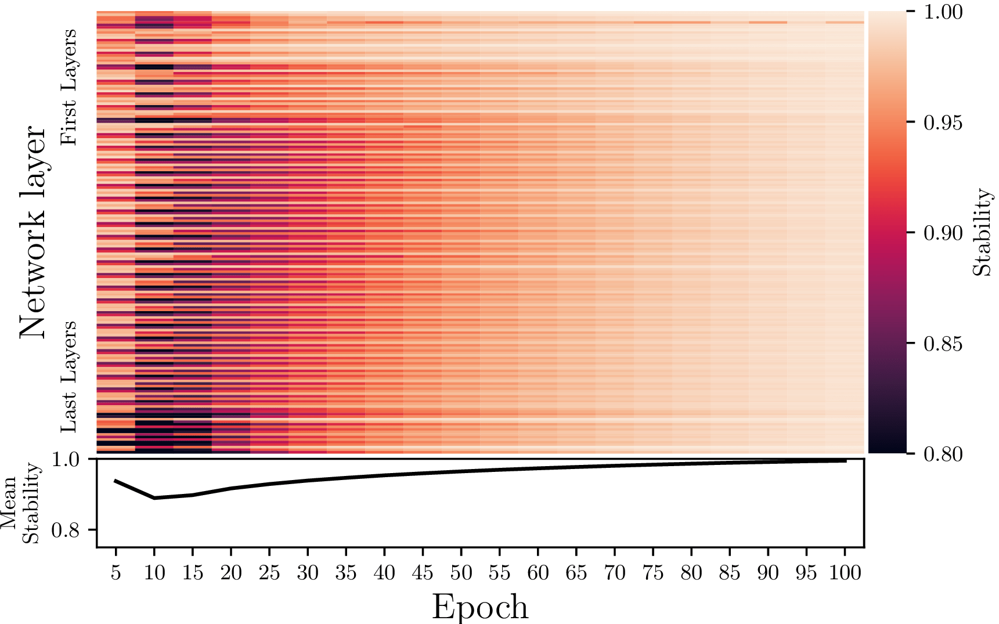
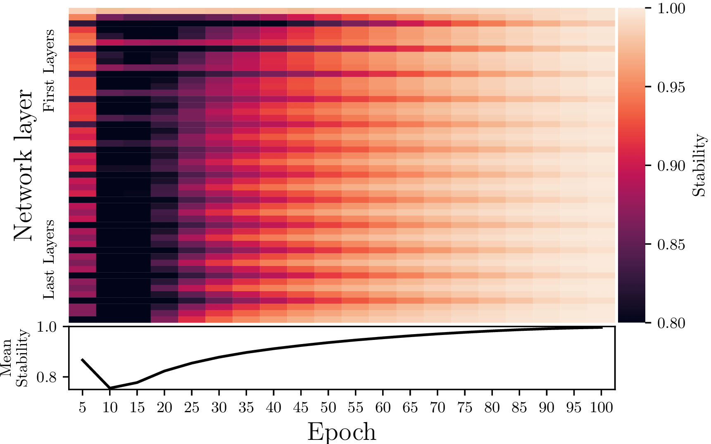
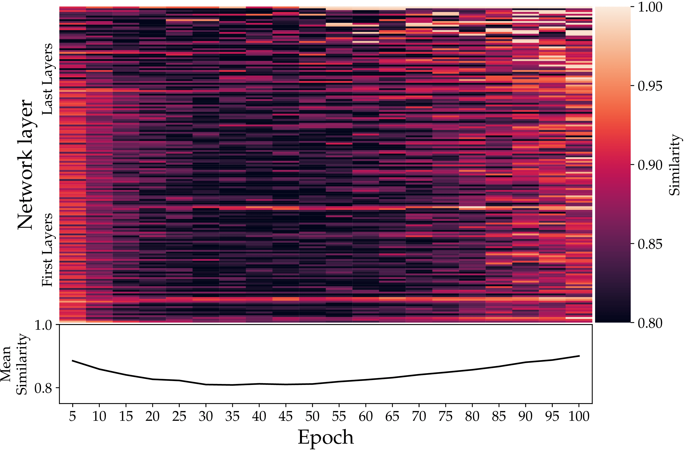
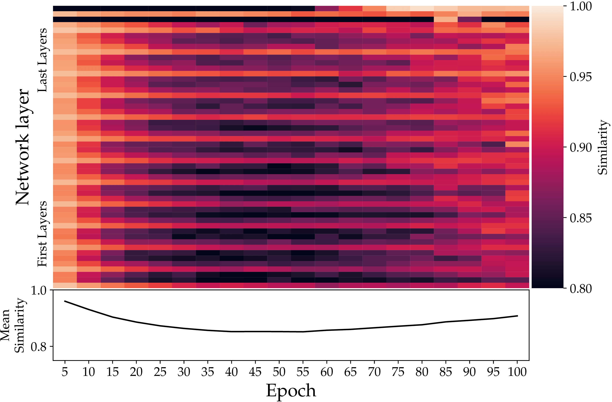

# Orthogonality-Informed Adaptive Low-Rank Training

# Description
The orthogonal bases inherent to the the weights of a neural networks stabalizes during training.
This framework aims to make use of this to fact to train low-rank neural networks.

# Orthogonal Stabilization
For more details see our paper [here](https://arxiv.org/abs/2401.08505)

The short version, is that a network's weights learn to the basis first, while learning the mixing throughout training.
This is like learning a language, where one learns the basics, before learning how to use them.
To show this, we tracked the basis `U @ V.T` with a metric we call *Stability*, and we tracked the linear mixing via the `R` matrix from QR decomposition. For the `R` tracking we used the enclidean distance.

### *Stability* of the basis:

ImageNet + ResNet-RS 101  |  ImageNet + Vision Transformer B/16
:-------------------------:|:-------------------------:
  |  

### Enclidean Similarity of the `R` mixing matrix:

ImageNet + ResNet-RS 101  |  ImageNet + Vision Transformer B/16
:-------------------------:|:-------------------------:
  |  

We use this to train low rank networks which stop training the `U` and `V` matrices during training. To do this we wrap the network in a class and replace the layers.
This is found in the `src/madonna/models/svd/model.py` in the `OIALRModel` class.

# Getting started

## Create the pipeline environment and install the madonna package
We recommend using an NVIDIA container with torch preinstalled.
Before using this make sure to install the package with
```
pip install -e .
```

This package use Hydra for config/experiment management, although most things are managed though OmegaConf when needed.
If this is used, it will load the sub-configs for the run.

## Starting example
The best place to start is with a minified ViT model training on CIFAR10.
The config for this experiment is in `configs/experiment/cifar10-minivit.yaml`.
We trained this using a slurm launcher and `enroot`, you can look at how to do this with either the `scripts/launch_run.sbatch`.
You can also use the `singularity` for launching the runs with `scripts/launch_singularity.sbatch`.

These scripts all build off the `configs/ortho_train.yaml` config. This is where the configs for all the options are inhereted from. However, they are all over-ridden by the `experiment` config, if it is secified.


# Project Organization
```
├── configs                              <- Hydra configuration files
│   ├── callbacks                               <- Callbacks configs
│   ├── data                                    <- Datamodule configs
│   ├── debug                                   <- Debugging configs
│   ├── experiment                              <- Experiment configs
│   ├── hparams_search                          <- Hyperparameter search configs
│   ├── local                                   <- Local configs
│   ├── log_dir                                 <- Logging directory configs
│   ├── logger                                  <- Logger configs
│   ├── model                                   <- Model configs
│   ├── trainer                                 <- Trainer configs
│   │
│   ├── test.yaml                               <- Main config for testing
│   └── train.yaml                              <- Main config for training
│
├── data                                 <- Project data
│   └── MNIST
│       ├── processed                               <- Processed data
│       └── raw                                     <- Raw data
│
├── docs                                 <- Directory for Sphinx documentation in rst or md.
├── models                               <- Trained and serialized models, model predictions
├── notebooks                            <- Jupyter notebooks.
├── reports                              <- Generated analysis as HTML, PDF, LaTeX, etc.
│   └── figures                                 <- Generated plots and figures for reports.
├── scripts                              <- Scripts used in project
│   ├── job_submission.sbatch               <- Submit training job to slurm
│   ├── job_submission_interactive.sbatch   <- Submit training job to slurm (interactive node)
│   ├── test.py                             <- Run testing
│   └── train.py                            <- Run training
│
├── src/madonna             <- Source code
│   ├── datamodules                             <- Lightning datamodules
│   ├── models                                  <- Lightning models
│   ├── utils                                   <- Utility scripts
│   │
│   ├── testing_pipeline.py                     <- Model evaluation workflow
│   └── training_pipeline.py                    <- Model training workflow
│
├── tests                                <- Tests of any kind
│   ├── helpers                                 <- A couple of testing utilities
│   ├── shell                                   <- Shell/command based tests
│   └── unit                                    <- Unit tests
│
├── .gitignore                           <- List of files/folders ignored by git
├── .pre-commit-config.yaml              <- Configuration of pre-commit hooks for code formatting
├── requirements.txt                     <- File for installing python dependencies
├── setup.cfg                            <- Configuration of linters and pytest
├── LICENSE.txt                          <- License as chosen on the command-line.
├── pyproject.toml                       <- Build configuration. Don't change! Use `pip install -e .`
│                                           to install for development or to build `tox -e build`.
├── setup.cfg                            <- Declarative configuration of your project.
├── setup.py                             <- [DEPRECATED] Use `python setup.py develop` to install for
│                                           development or `python setup.py bdist_wheel` to build.
└── README.md
```
